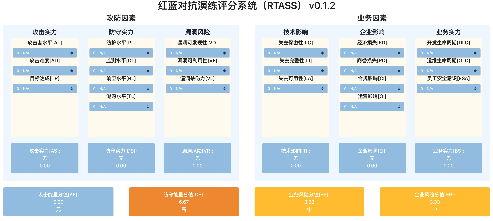

# **红蓝对抗评分系统 (RTASS) 0.3.2**

> Red Team Assessment Scoring System
>
> Github: <https://github.com/JDArmy/RTASS>
>
> 开源许可证: Apache
>
> 维护者: Monyer, 贡献者: devils, makato, vf3ng
>
> 在线计算器 <https://rtass.jd.army>

## **介绍**

红蓝对抗评分系统（RTASS，Red Team Assessment Scoring System）是一个开放式框架，用来评估单次网络红蓝对抗或实战演习中的攻防双方能力投入情况，以及涉及业务及所在企业所面临的风险程度。通过RTASS可以对红蓝对抗式网络实战攻防演练中，攻击方、防守方、业务方以及企业风险状况进行量化评分。本框架适用于网络红蓝对抗演练、网络实战攻防演习、红队评估、蓝军评估等通过模拟黑客APT手段对企业开展实网攻击的安全评估场景。

> RTASS由JD.Army创建、拥有和进行管理。JD.Army是专注于挖掘和解决企业安全运行风险隐患的专业型红队。JD.Army保留自行决定定期更新RTASS和本文档的权利。虽然JD.Army拥有RTASS的所有权利和利益，但它许可公众自由使用，遵循相关开源协议。

## **背景**

很多年前，企业通常仅靠采用“渗透测试”挖掘单个应用系统漏洞的方式来评估自身安全。为了评估漏洞的危害性，美国国家基础设施顾问委员会（NIAC）开发了一套通用漏洞评估系统CVSS，并交由事件响应和安全团队论坛（FIRST）进行托管。FIRST在前序版本基础上，又继续迭代了v2和v3版本，针对单个漏洞的危害性评估标准越来越精确和完善，也被各大安全组织和漏洞收录平台所使用。随着网络安全的发展，面临的网络威胁与日俱增，通过模拟黑客APT攻击手段与行为，对企业开展综合性安全评估的红蓝对抗实战演习方式开始被广泛采用。有些组织单位为了对攻击方之间以及防守方之间进行评估，也制定了一些评分制度。但这种评分制度只能衡量攻击方与攻击方之间，防守方与防守方之间的差异，科学性也有待商榷，也无法做攻击方与防守方间的能力对比。而在仅有一支攻击队伍和一支防守队伍的情况下，问题则更加突出：如果核心系统被突破，那么是说明攻击队伍强，还是说明防守队伍弱呢？如果核心系统没有被突破，那么是攻击队伍弱，还是防守队伍强呢？这是非常难衡量的，业内也没有一套成熟的体系来进行评价。因此JD.Army结合多年网络实战攻防演习以及红蓝对抗经验，参考CVSS以及OWASP风险评级方法，开发了这套针对实战演习场景下的红蓝对抗评分框架。

## **方法**

RTASS评分框架整体上由“攻防因素”与“业务因素”两大类别构成。

攻防因素主要从进攻以及防守角度上去衡量各自的强度，对渗透路径中的关键漏洞的杀伤力进行评价，最终结合业务因素形成“进攻能量”和“防守能量”分值。由进攻实力, 防守实力, 漏洞风险等过程因子及分值组成。

- 进攻实力指攻击方在单场次红蓝对抗演练中，在关键渗透路径上使用攻击技术的最高水平。
- 防守实力指防守方在单场次红蓝对抗演练中，在关键渗透路径上使用防守技术的最低水平。
- 漏洞风险指在单场次红蓝对抗演练中，在演练的关键渗透路径上对最关键漏洞的风险性评价。

业务因素主要是从可对企业造成的影响，业务安全能力水平，以及CIA信息安全三要素角度进行评价，最终结合攻防因素形成“业务风险”和“企业风险”分值。由进攻实力, 防守实力, 漏洞风险等过程因子及分值组成。

- 进攻实力指攻击方在单场次红蓝对抗演练中，在关键渗透路径上使用攻击技术的最高水平。
- 防守实力指防守方在单场次红蓝对抗演练中，在关键渗透路径上使用防守技术的最低水平。
- 漏洞风险指在单场次红蓝对抗演练中，在演练的关键渗透路径上对最关键漏洞的风险性评价。

为什么一定是“关键路径”和“最高”、“最低”、“最大”、“最关键”呢？

这是因为在单场次红蓝对抗当中，攻击者能够采取不同的战略形成不同的攻击路径，并在攻击路径中使用数十、上百种不同的TTPs。如果依次针对这些TTPs进行衡量，很明显是不现实的，也大幅增加了评估的工作量。

安全遵循“短板原理”，同样也遵循“长板原理” —— 攻击者不需要保证每一次TTPs的投入都是最高的技术能力，只要在关键路径上有一次或几次的高水平攻击，就有可能把企业目标拿下。所以我们以攻击者在进攻关键路径上投入的最高水平作为他们的进攻实力的表现。

显然，我们也能看出：攻击者实力并不能代表攻击者在单次红蓝对抗演练中的总的有效技术投入。我们拿物理学做个比喻：一个人在一个物体上施加的最大力，并不能代表这个人在物体上做的有效功。所以，为了衡量攻击者的“功”，我们引入“进攻能量”概念，用以表示攻击者在单次红蓝对抗演习中的总有效投入，也即攻击者在本次演练中投入的技术水平。

RTASS通过评估因子形成6个过程分值，过程分值再通过不同组合，形成针对攻击方、防守方、业务以及企业等不同角色的四项最终分值：进攻能量分值、防守能量分值、业务风险分值、企业风险分值。这4项分值均指代在单次演练中的情况，因此在不同的演练中，分值可能会有所不同。下面将对评分的方法和因子进行详细介绍。

### **进攻能量分值[OE, Offensive Energy]**

进攻能量分值[OE]由进攻实力[OS]、防守实力[DS]、企业影响[EI]等3个过程分值计算得出，是攻击方在单次演练中做的有效输出，可代表攻击方之于本次演练的水平。

> 进攻能量分值: OE = ( OS * 1 + DS * 1 + EI * 1 )/3

进攻实力代表攻击者在本次红蓝对抗中的攻击输出的最高水平。但还需要其他因子分值来校正：如果使用了很高级的技术，费了很大力气，但是没有取得功效，那么相当于在本次演练中做了无用功，就意味着进攻能量很低。引入“防守实力”因素是为了校正“进攻实力”在能力上的有效展现。一般来讲，防守的实力越强，在达成同等目标的前提下，说明攻击的实力越强；反之，如果防守者的实力越弱，那么为了达成目标，攻击者通常可以有更少的投入，进攻能量则没那么大。“企业影响”是用于衡量攻击者“做功”上的有效性。在单次演练中暴露的企业风险越多，说明攻击者的能量越强；反制，暴露的企业风险越少，说明攻击者在演练中的能量越小。

### **防守能量分值[DE, Defensive Energy]**

防守能量分值[DE]由防守实力[DS]、漏洞风险[VR]、企业影响[EI]等3个过程分值计算得出，是防守方在单次演练中的有效输出，可代表防守方之于本次演练的水平。

> 防守能量分值: DE = ( DS * 1 + ( 10 - VR ) * 1 + ( 10 - EI ) * 1 )/3

防守实力一般是防守者在本次红蓝对抗中的防守能力输出的较低水平。但不能简单认为“防守实力”就是防守的能量体现。因为不管防守实力再强，靶标最终被攻击者拿下，还是说明防守能力较低。漏洞风险的引入是为了校正“防守实力”在能力上的有效展现，与防守能量呈负相关。漏洞风险越高，防守能量越低。即便防守实力很强，但在进攻关键路径上暴露了严重的漏洞风险，那么说明防守的实力并没有落在实处，应该予以减分。企业影响与防守能量呈负相关，企业影响越大，防守能量越低。即便防守实力很强，漏洞面也很小，但是依然能给企业带来重大的影响，说明防守产生的有效能量是不够的，要予以减分。

### **业务风险分值[BR, Business Risk]**

业务风险分值[BR]由技术影响[TI]、企业影响[EI]、业务实力[BS]等3个过程分值计算得出，指业务在安全上暴露的风险程度，可代表参演业务方在本次演练中的安全水平。

> 业务风险分值: BR = ( TI * 1 + EI * 1 + ( 10 - BS ) * 1 )/3

技术影响主要从安全三要素：保密性、完整性和可用性衡量对业务造成的影响。业务的技术影响越大，说明业务的风险性越高。企业影响与业务风险息息相关，如果能给企业带来较大的影响，不管是经济损失、商誉损失还是合规影响，那么都会较大程度上影响企业的发展，进而影响业务的发展。业务实力主要体现在SDL或者是DevSecOps的落实上，如果出现了问题，那么将会在安全的推进以及风险的消除上带来较大的阻碍，进而会给业务造成重大风险。因此业务实力与业务风险分值呈现负相关，实力越低风险越大。

### **企业风险分值[ER, Enterprise Risk]**

企业风险分值[ER]由防守实力[DS]、漏洞风险[VR]、企业影响[EI]等3个过程分值计算得出，指企业在安全上暴露的风险程度，可代表企业整体上在本次演练中表现出的安全水平。

> 企业风险分值: ER = ( ( 10 - DS ) * 1 + VR * 1 + EI * 1 )/3

防守实力与企业风险呈现负相关。一个企业如果在安全建设上的投入不大，一般会直接作用在防护能力、检测能力和响应能力上，即防守实力上。反之，如果企业防守实力弱，那么说明企业在安全建设或者防守团队建设上面临问题，将使企业面临更多的风险。如果渗透路径上的关键漏洞是非常容易被发现、被利用，且杀伤力极大的，一般说明防守在日常的安全运营、SDL或DevSecOps的安全流程落地上出现了比较大的问题，企业的风险性会增加。而“企业影响”更是关系到企业的正常运营、营收甚至是生死存亡，因此与企业风险相关。

当然，上述关联也有可能随着RTASS的进化有所改变。

在本评分框架中，每个评分因子都有0到4共5个评分项。而过程分值和最终分值：最低分0分，最高分为10分。其中，各分值对应等级的分布如下：

| 分值         | 等级 |
| ------------ | ---- |
| 0.00         | 无   |
| 0.01 - 3.99  | 低   |
| 4.00 - 6.99  | 中   |
| 7.00 - 8.99  | 高   |
| 9.00 - 10.00 | 极   |

> 注：本框架部分评分因子如“漏洞风险”、“企业影响”等参考借鉴了OWASP风险评级方法中相关因子。

## **评分因子**

### **攻防因素**

攻防因素由进攻实力、防守实力、漏洞风险3部分组成。

#### **进攻实力[OS]**

进攻实力由进攻水平[OL]、进攻难度[OD]、目标达成[TR]、对抗溯源能力[AL]4个因子计算得出。计算方法为：

> 进攻实力[OS] = ( OL * 1 * 2.5 + OD * 1 * 2.5 + TR * 1 * 2.5 + AL * 1 * 2.5 )/4

##### **进攻水平[OL]**

进攻水平主要评估攻击者在评估路径中使用的最高技术水平。

- 0 - 相当于入门级黑客
- 1 - 相当于普通水平黑客或工具、脚本黑客
- 2 - 等同精通渗透技术的黑客
- 3 - 需要较为专业的团队配合
- 4 - 相当于国家级APT黑客团队

##### **进攻难度[OD]**

进攻难度主要评估攻击者在整个评估路径中搞定难题的最高难度。

- 0 - 对于专业黑客来说，几乎没有难度
- 1 - 对于专业黑客来说，有点难度
- 2 - 对于专业黑客来说，有较大难度
- 3 - 对于专业黑客来说，很难搞定
- 4 - 对于专业黑客来说，几乎不能搞定

##### **目标达成[TR]**

目标达成主要评估攻击者是否达成预期目标。

- 0 - 基本没达成
- 1 - 少量达成
- 2 - 中量达成
- 3 - 大量达成
- 4 - 完全达成

##### **对抗溯源能力[AL]**

对抗溯源能力主要评估攻击者的对抗溯源能力如何。

- 0 - 攻击者真实身份信息被溯源，或者攻击资产或计算机被反向控制
- 1 - 攻击者虚拟身份特征或境内真实IP被溯源
- 2 - 攻击者的持续性攻击行为被指纹标定，或大量攻击指标（IOA）被（蜜罐等）记录标定
- 3 - 攻击者的固定C2服务器IP或固定隧道回连IP被溯源
- 4 - 几乎溯源不到任何有用的信息

#### **防守实力[DS]**

防守实力由防护水平[PL]、监测水平[DL]、响应水平[RL]、溯源水平[TL]4个因子计算得出。计算方法为：

> 防守实力[DS] = ( PL * 1 * 2.5 + DL * 1 * 2.5 + RL * 1 * 2.5 + TL * 1 * 2.5 )/4

##### **防护水平[PL]**

防护水平主要评估防守者对关键渗透路径的拦截能力。

- 0 - 几乎没有拦截
- 1 - 轻微的拦截
- 2 - 较强的拦截
- 3 - 非常强的拦截
- 4 - 几乎难以突破

##### **监测水平[DL]**

监测水平主要评估防守者对关键渗透路径的网络威胁发现能力。

- 0 - 几乎监测不到威胁
- 1 - 监测到非重要资产的零星攻击威胁
- 2 - 监测到少量关键路径威胁
- 3 - 监测到大量关键路径威胁
- 4 - 几乎监测到全部威胁

##### **响应水平[RL]**

响应水平主要评估防守者对沦陷系统的恢复能力、修复能力和应急响应能力。

- 0 - 几乎难以推进（3天以上）
- 1 - 响应较为缓慢（12小时以上）
- 2 - 响应较为及时（12小时内）
- 3 - 响应接近实时（2小时内）
- 4 - 实时响应（30分钟内）

##### **溯源水平[TL]**

溯源水平主要评估防守者是否能够对攻击者进行有效溯源。

- 0 - 几乎溯源不到任何有用的信息
- 1 - 攻击者的固定C2服务器IP或固定隧道回连IP被溯源
- 2 - 攻击者的持续性攻击行为被指纹标定，或大量攻击指标（IOA）被（蜜罐等）记录标定
- 3 - 攻击者虚拟身份特征或境内真实IP被溯源
- 4 - 攻击者真实身份信息被溯源，或者攻击资产或计算机被反向控制

#### **漏洞风险[VR]**

漏洞风险由漏洞可发现性[VD]、漏洞可利用性[VE]、漏洞杀伤力[VL]、漏洞暴露窗口[VDW]4个因子计算得出。计算方法为：

> 漏洞风险[VR] = ( VD * 1 * 2.5 + VE * 1 * 2.5 + VL * 1 * 2.5 + VDW * 1 * 2.5 )/4

##### **漏洞可发现性[VD]**

漏洞可发现性主要评估渗透路径中的关键漏洞的可发现性。

- 0 - 几乎难以发现
- 1 - 对于专业黑客来说，发现比较困难
- 2 - 对于专业黑客来说，发现难度中等
- 3 - 对于专业黑客来说，发现比较简单
- 4 - 使用通用自动化工具即可发现

##### **漏洞可利用性[VE]**

漏洞可利用性主要评估渗透路径中的关键漏洞的可利用性。

- 0 - 几乎难以利用
- 1 - 对于专业黑客来说，利用比较困难
- 2 - 对于专业黑客来说，利用难度中等
- 3 - 对于专业黑客来说，利用比较简单
- 4 - 使用通用自动化工具即可利用

##### **漏洞杀伤力[VL]**

漏洞杀伤力主要评估渗透路径中的关键漏洞的最大杀伤力。

- 0 - 几乎没有危害
- 1 - 较低的杀伤力，影响个别非核心资产
- 2 - 中等规模的杀伤力，影响一部分非核心资产
- 3 - 大范围的杀伤力，影响个别核心资产
- 4 - 极其广泛的杀伤力，影响一部分核心资产

##### **漏洞暴露窗口[VDW]**

漏洞暴露窗口主要评估渗透路径中的关键漏洞的最大暴露时间窗口。

- 0 - 几乎没有对外披露
- 1 - 黑客圈小范围的非公开传播披露
- 2 - 公开披露小于3天
- 3 - 公开披露大于3天
- 4 - 公开披露大于1周

### **业务因素**

业务因素由技术影响、企业影响、业务实力3部分组成。

#### **技术影响[TI]**

技术影响由失去保密性[LC]、失去完整性[LI]、失去可用性[LA]3个因子计算得出。计算方法为：

> 技术影响[TI] = ( LC * 1 * 2.5 + LI * 1 * 2.5 + LA * 1 * 2.5 )/3

##### **失去保密性[LC]**

失去保密性主要评估可以泄露多少数据以及它的敏感度如何。

- 0 - 不能造成数据泄露
- 1 - 可泄露少量的非敏感数据
- 2 - 可泄露大量的非敏感数据
- 3 - 可泄露少量的敏感数据
- 4 - 可泄露大量的敏感数据

##### **失去完整性[LI]**

失去完整性主要评估有多少数据可能被损坏，损坏程度如何。

- 0 - 不能造成数据损坏
- 1 - 可损坏少量非核心数据
- 2 - 可损坏大量非核心数据
- 3 - 可损坏少量的核心数据
- 4 - 可损坏大量核心数据

##### **失去可用性[LA]**

失去可用性主要评估可能会丢失多少服务，它有多重要。

- 0 - 不能造成业务中断
- 1 - 可导致企业少量的非核心业务中断
- 2 - 可导致企业大量的非核心业务中断
- 3 - 可导致企业少量的核心业务中断
- 4 - 可导致企业大量的核心业务中断

#### **企业影响[EI]**

企业影响由经济损失[FD]、商誉损失[RD]、合规影响[CI]3个因子计算得出。计算方法为：

> 企业影响[EI] = ( FD * 1 * 2.5 + RD * 1 * 2.5 + CI * 1 * 2.5 )/3

##### **经济损失[FD]**

经济损失主要评估可对企业经济造成的最大影响。

- 0 - 低于修复漏洞的成本
- 1 - 不会对企业年利润有明显影响
- 2 - 可以影响一定的企业年利润
- 3 - 对企业年度利润有显著影响
- 4 - 对企业年利润影响重大

##### **商誉损失[RD]**

商誉损失主要评估是否会导致企业声誉受损从而损害业务。

- 0 - 不能造成商誉损失
- 1 - 可造成轻微的商誉损害
- 2 - 可造成严重的商誉损害
- 3 - 可导致大客户或大量客户流失
- 4 - 可造成品牌重大损害

##### **合规影响[CI]**

合规影响主要评估出现的问题或攻击者进行恶意行动会带来多少违规风险。

- 0 - 不能造成违规风险
- 1 - 能造成轻微的违规风险
- 2 - 能造成较为明显的违规风险
- 3 - 能造成非常高调的违规风险
- 4 - 严重违规或造成违法

#### **业务实力[BS]**

业务实力由开发生命周期[DLC]、运维生命周期[OLC]、员工安全意识[ESA]3个因子计算得出。计算方法为：

> 业务实力[BS] = ( DLC * 1 * 2.5 + OLC * 1 * 2.5 + ESA * 1 * 2.5 )/3

##### **开发生命周期[DLC]**

开发生命周期主要评估是否发现在软件开发生命周期中存在安全问题。

- 0 - 几乎没有考虑安全问题
- 1 - 有大量的安全流程问题
- 2 - 有中量的安全流程问题
- 3 - 有少量的安全流程问题
- 4 - 基本没有安全流程问题

##### **运维生命周期[OLC]**

运维生命周期主要评估是否发现在运维生命周期中存在安全问题。

- 0 - 几乎没有考虑安全问题
- 1 - 有大量的安全流程问题
- 2 - 有中量的安全流程问题
- 3 - 有少量的安全流程问题
- 4 - 基本没有安全流程问题

##### **员工安全意识[ESA]**

员工安全意识主要评估在评估过程中大部分员工是否有安全意识问题。

- 0 - 几乎全员没有安全意识
- 1 - 大部分关键岗位员工安全意识较弱
- 2 - 少部分关键岗位员工安全意识较弱
- 3 - 大部分关键岗位员工安全意识较高
- 4 - 全部员工都有极高的安全意识

## **能力因素**

为了能够对评分因子进行更细化的衡量，RTASS在Base版本基础上研发了Plus版本，给评分因子增加了更细化的“能力因素”。有了能力因素后，RTASS在可以对攻击方、防守方、业务方与企业进行宏观评价外，还可以更细致地指示出它们的能力点强弱，以及需要进一步提升的方向。截止目前，如下评分因子具有能力选项：

### **进攻水平[OL]**

进攻水平由情报侦察能力[IRC]、武器化能力[WC]、漏洞挖掘利用能力[VMEC]、抗威胁检测能力[ATDC]、社会工程能力[SEC]、权限维持能力[PPC]、隧道搭建能力[TCC]、横向移动能力[LMC] 8个能力项组成。计算方法为：

> 进攻水平[OL] = ( IRC * 1 + WC * 1 + VMEC * 1 + ATDC * 1 + SEC * 1 + PPC * 1 + TCC * 1 + LMC * 1 )/8

##### **情报侦察能力[IRC]**

情报侦察能力主要评估攻击者在信息收集、情报侦察阶段的能力

- 0 - 不能获得有效的情报信息
- 1 - 有基本的IT资产与网络信息收集能力
- 2 - 有较强的资产收集能力，能够找到偏僻脆弱资产；有较强的组织人员侦察能力，能够找到关键社工目标
- 3 - 能够通过主被动多种手段全面掌握目标组织、运营、协同、人员、资产、安全、网络架构等情报，并制定针对性攻击方案
- 4 - 能够在目标无感知前提下，掌握目标企业线上线下运营全貌以及靶标细节，准确绘制攻击路径，快速精准找到据点建立方案

##### **武器化能力[WC]**

武器化能力主要评估攻击者在武器化、资源开发阶段的能力

- 0 - 无编程或程序设计能力
- 1 - 具备简单的脚本EXP编写能力
- 2 - 能够编写较为复杂的渗透工具
- 3 - 能够自研C2、自动化渗透平台
- 4 - 能够设计实现高级复杂的核弹级武器（如Stuxnet、Bvp47、Wannacry等）

##### **漏洞挖掘利用能力[VMEC]**

漏洞挖掘利用能力主要评估攻击者的黑白盒漏洞挖掘能力和实战化漏洞利用能力

- 0 - 不能挖掘出有利用价值的漏洞或不能成功利用漏洞
- 1 - 能够挖掘应用常规漏洞并成功利用
- 2 - 能够挖掘应用高复杂漏洞并成功利用
- 3 - 能够挖掘通用组件或中间件漏洞并成功利用
- 4 - 能够挖掘操作系统及通用系统组件级漏洞并成功利用

##### **抗威胁检测能力[ATDC]**

抗威胁检测能力主要评估攻击者绕过WAF、防火墙、杀软，以及威胁检测设备的能力

- 0 - 基本没有对抗威胁检测系统的手段或能力
- 1 - 能够绕过WAF、NGFW等防御手段实现漏洞利用
- 2 - 能够绕过杀软、HIDPS等防御手段实现C2无告警上线
- 3 - 在打点及内网横向移动过程中有较低的威胁感知
- 4 - 防守实力极强情况下，在靶标突破后可实现无感知、长期、稳定目标行动

##### **社会工程能力[SEC]**

社会工程能力主要评估攻击者在网络或地面的社工能力以及成功率

- 0 - 不能实施成功的社工
- 1 - 对一般人员成功社工且取得权限
- 2 - 对经过安全意识培训过的非安全从业人员成功社工且取得权限
- 3 - 对从事安全岗位人员成功社工并取得权限
- 4 - 能够对最专业的安全工程师成功社工且取得权限

##### **权限维持能力[PPC]**

权限维持能力主要评估攻击者在获得初始访问后，对立足点的权限维持能力

- 0 - 无法维持据点权限的稳定性与持续性
- 1 - 能够在据点上实现长期稳定的基本命令执行
- 2 - 在重启的情况下实现无感知权限维持
- 3 - 能够无感知提升据点权限执行更多命令
- 4 - 在经过应急响应后依然实现可权限维持

##### **隧道搭建能力[TCC]**

隧道搭建能力主要评估攻击者在获得初始访问后的隧道搭建能力

- 0 - 无法搭建畅通稳定隧道
- 1 - 能够搭建简单跳板，实现C2上线和内网漫游
- 2 - 能够根据环境所需搭建多层级跳板隧道
- 3 - 能够将跳板流量隐匿到正常网络流量中，实现威胁无感知
- 4 - 在前者基础上，能够穿透目标多层内网、采用多种不同协议搭建长期、稳定隧道链路

##### **横向移动能力[LMC]**

横向移动能力主要评估攻击者在获得初始访问后，获取更多权限，扩大战果的网络拓展能力

- 0 - 据点即终点，无继续网络拓展能力
- 1 - 能够通过信息采集确认据点身份、位置，获得有用情报信息
- 2 - 前者基础上，能够进行无感知内网刺探，找到横向移动路径或靶标进行移动
- 3 - 前者基础上，能够获取访问凭证并成功实现凭证利用进行横向移动
- 4 - 前者基础上，通过水坑、社工、供应链等多种复杂技术手段实现无感知横向移动

### **目标达成[TR]**

目标达成由目标达成时间[GAT]、目标达成成本[GAC]、目标行动能力[GAA] 3个能力项组成。计算方法为：

> 目标达成[TR] = ( GAT * 1 + GAC * 1 + GAA * 1 )/3

##### **目标达成时间[GAT]**

目标达成时间主要评估攻击者对靶标进行突破控制的最小达成时间。

- 0 - 设定时间内未完成对目标系统的突破控制
- 1 - 设定时间内未完成靶标突破，但对多个核心系统突破控制
- 2 - 设定时间内完成对部分靶标的突破控制
- 3 - 1-3周内完成主要核心靶标突破控制
- 4 - 1-3天内完成主要核心靶标突破控制

##### **目标达成成本[GAC]**

目标达成成本主要评估攻击者为了达成目标所需要付出的武器、人力、漏洞等的工作成本

- 0 - 严重入不敷出
- 1 - 很大成本(核弹级0day等)
- 2 - 较大成本(通用级0day等)
- 3 - 较低的成本
- 4 - 几乎没有成本

##### **目标行动能力[GAA]**

目标行动能力主要评估攻击者在获得对靶标访问权限后，所能够最大程度达成最终目标的能力

- 0 - 无法在靶标上达成目标行动
- 1 - 可实现对靶标的部分数据渗漏
- 2 - 可实现对靶标的部分操作影响
- 3 - 可实现对靶标的全部数据渗漏
- 4 - 可在无感知情况下完成全部数据渗漏，或造成长期持续性影响

### **防护水平[PL]**

防护水平由日志事件管理能力[IEMC]、软件更新管理能力[SUMC]、威胁识别阻断能力[TIBC]、基线安全管理能力[BSMC]、账号安全管理能力[ASMC]、权限安全管理能力[PSMC]、网络访问控制能力[NACC] 7个能力项组成。计算方法为：

> 防护水平[PL] = ( IEMC * 1 + SUMC * 1 + TIBC * 1 + BSMC * 1 + ASMC * 1 + PSMC * 1 + NACC * 1 )/7

##### **日志事件管理能力[IEMC]**

日志事件管理能力主要评估防守者对各类日志及事件的管理能力

- 0 - 日志管理规范落实不到位，存在大量日志缺失
- 1 - 有分散的日志和事件追查能力
- 2 - 有集中的安全日志与事件管理系统
- 3 - 能够对日志事件进行归类汇总，对威胁进行识别、定级和告警
- 4 - 有全面且系统化日志事件响应与自动化安全运营能力

##### **软件更新管理能力[SUMC]**

软件更新管理能力主要评估防守者对各类软件、系统、组件、依赖的漏洞管理能力。

- 0 - 没有软件更新管理能力，存在大量长期严重漏洞
- 1 - 可以对生产服务器的操作系统补丁进行及时安全更新
- 2 - 前者基础上，可以对开发、运维常用软件及员工办公终端软件进行统一管理和及时安全更新
- 3 - 前者基础上，可以对系统、容器的服务程序、中间件进行版本管理和及时安全更新
- 4 - 前者基础上，可以对应用依赖、引用的各项组件进行版本管理和及时安全更新

##### **威胁识别阻断能力[TIBC]**

威胁识别阻断能力主要评估企业内外网络及终端对威胁的识别和阻断能力。

- 0 - 没有威胁识别阻断设施
- 1 - 有边界流量防护及阻断设施
- 2 - 前者基础上，有内部流量防护及阻断设施
- 3 - 前者基础上，有端点防护和阻拦设施
- 4 - 前者基础上，有安全编排与自动化响应设施

##### **基线安全管理能力[BSMC]**

基线安全管理能力主要评估防守者对各类系统、应用的基线安全管理能力。

- 0 - 没有基线安全管理能力
- 1 - 有服务安全配置及审计日志基线管理
- 2 - 前者基础上，有访问控制基线管理
- 3 - 前者基础上，有账号权限及认证授权基线管理
- 4 - 前者基础上，有针对服务、网络、供应链的安全测试评估流程

##### **账号安全管理能力[ASMC]**

账号安全管理能力主要评估防守者对各类账号的统一管理、动态威胁识别能力。

- 0 - 没有身份统一管理能力
- 1 - 统一的账号管理与认证
- 2 - 更安全的认证技术（去密码或MFA等)
- 3 - 基于可信设备的统一身份管理
- 4 - 动态自适应及持续认证

##### **权限安全管理能力[PSMC]**

权限安全管理能力主要评估防守者对各类账号的统一权限收口及动态管控能力。

- 0 - 没有权限统一管理能力
- 1 - 统一的功能粒度权限管理（授权、鉴权等）
- 2 - 权限最小化的持续评估和在线治理
- 3 - 统一的数据粒度权限管理
- 4 - 权限防滥用的持续评估与动态管控

##### **网络访问控制能力[NACC]**

网络访问控制能力主要评估企业内外网络及终端互相间访问控制及颗粒度。

- 0 - 网络没有进行任何访问控制
- 1 - 办公网与生产网有网络隔离，通过堡垒机访问
- 2 - 前者基础上，外部客户服务与内部员工服务有网络隔离
- 3 - 前者基础上，不同的应用服务之间有网络隔离
- 4 - 前者基础上，有更细粒度的微隔离能力

### **监测水平[DL]**

监测水平由外部威胁流量感知[ETTA]、外部鱼叉攻击感知[EHAA]、近源渗透攻击感知[PPAA]、内网威胁流量感知[ITTA]、端点恶意软件感知[EMA]、端点异常行为感知[EABA]、威胁检出率[TDR]、威胁鉴别及时率[TITR] 8个能力项组成。计算方法为：

> 监测水平[DL] = ( ETTA * 1 + EHAA * 1 + PPAA * 1 + ITTA * 1 + EMA * 1 + EABA * 1 + TDR * 1 + TITR * 1 )/8

##### **外部威胁流量感知[ETTA]**

外部威胁流量感知主要评估企业在遭受外部网络攻击时的威胁流量感知能力。

- 0 - 几乎无任何感知
- 1 - 有少量感知
- 2 - 有中量感知
- 3 - 有大量感知
- 4 - 几乎全部感知

##### **外部鱼叉攻击感知[EHAA]**

外部鱼叉攻击感知主要评估企业在遭受外部鱼叉攻击时的威胁感知及处置能力。

- 0 - 无任何感知
- 1 - 感知到攻击事件并能够捕获攻击样本
- 2 - 前者基础上，能够溯源出所有被钓人员并告警
- 3 - 前者基础上，能够感知到钓鱼中招员工，提取终端样本，还原攻击手法
- 4 - 前者基础上，快速感知到钓鱼木马的落地、执行与上线动作，并能及时阻断

##### **近源渗透攻击感知[PPAA]**

近源渗透攻击感知主要评估企业在遭受近源临场攻击、物理渗透时的威胁感知及处置能力。

- 0 - 几乎无任何感知
- 1 - 在被成功攻击后，通过溯源确定近源渗透攻击路径。
- 2 - 通过技术监控与行政手段，成功发现近源渗透痕迹，包括但不限于收集到U盘、捕获到HID攻击、wifi爆破等行为
- 3 - 前者基础上，能详细分析出攻击者所用攻击手段、攻击的过程，包括但不限于针对wifi的攻击手段分析、投放木马的分析
- 4 - 前者基础上，具备独立近源感知能力来快速发现近源攻击行为并及时阻断。

##### **内网威胁流量感知[ITTA]**

内网威胁流量感知主要评估企业在遭受从内部发起的网络攻击时的威胁流量感知能力。

- 0 - 几乎无任何感知
- 1 - 可感知到无差别全内网扫描行为，识别出异常点并迅速定位扫描来源IP
- 2 - 可基于流量特征捕获到小范围如C段的内网扫描，还原目标及目的。
- 3 - 前者基础上，感知部分凭证利用与横向移动行为，或数据渗漏行为
- 4 - 几乎感知全部攻击过程，及攻击者使用的加密C2信道

##### **端点恶意软件感知[EMA]**

端点恶意软件感知主要评估企业个人办公机、服务器及其他终端设备在遭受恶意软件攻击时的威胁感知能力。

- 0 - 几乎无任何感知
- 1 - 有畅通的员工安全问题反馈途径，快速感知到终端攻击
- 2 - 能够通过终端检测响应、威胁流量分析感知到终端攻击
- 3 - 有能力捕获到攻击样本，提取有效网络或主机IOC并实施监控、阻断能力部署
- 4 - 有完善的自动化沙盒分析、威胁识别情报及策略、安全编排与威胁自动化处置机制

##### **端点异常行为感知[EABA]**

端点异常行为感知主要评估企业个人办公机、服务器及其他终端设备对危险操作以及异常行为的威胁感知能力。

- 0 - 几乎无任何感知
- 1 - 能够感知到针对本机的大规模网络扫描行为并告警
- 2 - 能够感知到针对本机的网络密码爆破行为并告警
- 3 - 前者基础上，能够感知终端上对特权账号、敏感文件、进程的的异常操作行为
- 4 - 前者基础上，能够感知终端之间的异常远程访问行为

##### **威胁检出率[TDR]**

威胁检出率主要评估防守者在系统检测威胁后，通过人工或其他手段实际鉴别出的高危威胁覆盖率。

- 0 - 无任何威胁检出（12小时内）
- 1 - 检出率：0 < N <= 25%
- 2 - 检出率：25% < N <= 50%
- 3 - 检出率：50% < N <= 80%
- 4 - 检出率：80% < N <= 100%

##### **威胁鉴别及时率[TITR]**

威胁鉴别及时率主要评估防守者在系统检出威胁后，通过人工或其他手段实际鉴别出的高危威胁及时率。

- 0 - 未及时鉴别威胁（12小时内）
- 1 - 及时率：0 < N <= 25%
- 2 - 及时率：25% < N <= 50%
- 3 - 及时率：50% < N <= 80%
- 4 - 及时率：80% < N <= 100%

### **响应水平[RL]**

响应水平由威胁处置能力[THC]、威胁处置及时率[TDTR]、威胁分析能力[TAC] 3个能力项组成。计算方法为：

> 响应水平[RL] = ( THC * 1 + TDTR * 1 + TAC * 1 )/3

##### **威胁处置能力[THC]**

威胁处置能力主要评估防守者在检测到威胁后的威胁处置覆盖率。

- 0 - 未进行任何处置（12小时内）
- 1 - 处置率：0 < N <= 25%
- 2 - 处置率：25% < N <= 50%
- 3 - 处置率：50% < N <= 80%
- 4 - 处置率：80% < N <= 100%

##### **威胁处置及时率[TDTR]**

威胁处置及时率主要评估防守者在检测到威胁后的威胁处置及时率。

- 0 - 未进行及时处置（12小时内）
- 1 - 及时率：0 < N <= 25%
- 2 - 及时率：25% < N <= 50%
- 3 - 及时率：50% < N <= 80%
- 4 - 及时率：80% < N <= 100%

##### **威胁分析能力[TAC]**

威胁分析能力主要评估防守者对威胁的识别、分析、逆向等能力

- 0 - 没有威胁分析能力
- 1 - 能够准确识别威胁，提取有效IOC
- 2 - 有自动化威胁分析与情报共享机制
- 3 - 能够进行复杂的威胁分析，还原攻击手法及目标
- 4 - 有自动化威胁分析技术，以及专业化的逆向分析能力，可形成完整分析报告

### **溯源水平[TL]**

溯源水平由入侵路径溯源能力[IPTC]、攻击者溯源反制能力[ATCC]、欺骗诱捕能力[DEC] 3个能力项组成。计算方法为：

> 溯源水平[TL] = ( IPTC * 1 + ATCC * 1 + DEC * 1 )/3

##### **入侵路径溯源能力[IPTC]**

入侵路径溯源能力主要评估防守者对入侵者的入侵路径的溯源能力

- 0 - 没有入侵路径溯源能力
- 1 - 攻击路径还原度 0 - 25%
- 2 - 攻击路径还原度 25% - 50%
- 3 - 攻击路径还原度 50% - 80%
- 4 - 攻击路径还原度 80% - 100%

##### **攻击者溯源反制能力[ATCC]**

攻击者溯源反制能力主要评估防守者对攻击者的溯源反制能力

- 0 - 几乎溯源不到任何有用的信息
- 1 - 攻击者的C2服务器IP或跳板IP被溯源
- 2 - 攻击者常用虚拟身份或境内真实IP被溯源
- 3 - 攻击者的攻击资产或计算机被反向控制
- 4 - 攻击者真实身份信息被溯源

##### **欺骗诱捕能力[DEC]**

欺骗诱捕能力主要评估企业蜜罐蜜网建设，以及对攻击者的欺骗诱捕能力

- 0 - 无欺骗诱捕能力
- 1 - 在网络中搭建了高仿真蜜罐
- 2 - 在网络中搭建了高仿真蜜网，可以将攻击者引入到蜜网中
- 3 - 动态蜜网能力，可以直接从生产环境将攻击者所有流量引入蜜网
- 4 - 有完善的密令喷洒、蜜标与蜜应用定制、蜜场管理能力，可实现主动式吸引、动态自适应及反制诱捕能力

## **向量字符串**

参考CVSS评分框架，RTASS同样使用“向量字符串”来记录评分过程，以及对RTASS指标信息进行传输。RTASS向量字符串以标签“RTASS:”和当前版本的数字表示（譬如：1.0.0）开头。指标信息以一组指标的形式出现，每个指标前面都有一个正斜杠“/”，作为分隔符。每个指标都是缩写形式的指标名称、冒号及指标值构成。缩写形式在本规范的前面定义（在每个因子名称后面的括号中），并在下表中进行了总结。

### **因子**

| 因子名称          | 可能的值 |
| ----------------- | -------- |
| 进攻水平[OL]      | 0-4      |
| 进攻难度[OD]      | 0-4      |
| 目标达成[TR]      | 0-4      |
| 对抗溯源能力[AL]  | 0-4      |
| 防护水平[PL]      | 0-4      |
| 监测水平[DL]      | 0-4      |
| 响应水平[RL]      | 0-4      |
| 溯源水平[TL]      | 0-4      |
| 漏洞可发现性[VD]  | 0-4      |
| 漏洞可利用性[VE]  | 0-4      |
| 漏洞杀伤力[VL]    | 0-4      |
| 漏洞暴露窗口[VDW] | 0-4      |
| 失去保密性[LC]    | 0-4      |
| 失去完整性[LI]    | 0-4      |
| 失去可用性[LA]    | 0-4      |
| 经济损失[FD]      | 0-4      |
| 商誉损失[RD]      | 0-4      |
| 合规影响[CI]      | 0-4      |
| 开发生命周期[DLC] | 0-4      |
| 运维生命周期[OLC] | 0-4      |
| 员工安全意识[ESA] | 0-4      |

### **能力**

> 注：在RTASS Base评分模式下，能力因素不是必须的；在RTASS Plus评分模式下，能力因素是必须的。

| 能力名称                 | 可能的值 |
| ------------------------ | -------- |
| 情报侦察能力[IRC]        | 0-4      |
| 武器化能力[WC]           | 0-4      |
| 漏洞挖掘利用能力[VMEC]   | 0-4      |
| 抗威胁检测能力[ATDC]     | 0-4      |
| 社会工程能力[SEC]        | 0-4      |
| 权限维持能力[PPC]        | 0-4      |
| 隧道搭建能力[TCC]        | 0-4      |
| 横向移动能力[LMC]        | 0-4      |
| 目标达成时间[GAT]        | 0-4      |
| 目标达成成本[GAC]        | 0-4      |
| 目标行动能力[GAA]        | 0-4      |
| 日志事件管理能力[IEMC]   | 0-4      |
| 软件更新管理能力[SUMC]   | 0-4      |
| 威胁识别阻断能力[TIBC]   | 0-4      |
| 基线安全管理能力[BSMC]   | 0-4      |
| 账号安全管理能力[ASMC]   | 0-4      |
| 权限安全管理能力[PSMC]   | 0-4      |
| 网络访问控制能力[NACC]   | 0-4      |
| 外部威胁流量感知[ETTA]   | 0-4      |
| 外部鱼叉攻击感知[EHAA]   | 0-4      |
| 近源渗透攻击感知[PPAA]   | 0-4      |
| 内网威胁流量感知[ITTA]   | 0-4      |
| 端点恶意软件感知[EMA]    | 0-4      |
| 端点异常行为感知[EABA]   | 0-4      |
| 威胁检出率[TDR]          | 0-4      |
| 威胁鉴别及时率[TITR]     | 0-4      |
| 威胁处置能力[THC]        | 0-4      |
| 威胁处置及时率[TDTR]     | 0-4      |
| 威胁分析能力[TAC]        | 0-4      |
| 入侵路径溯源能力[IPTC]   | 0-4      |
| 攻击者溯源反制能力[ATCC] | 0-4      |
| 欺骗诱捕能力[DEC]        | 0-4      |

RTASS Base模式向量字符串示例如下：
RTASS:0.3.2/OL:2/OD:0/TR:0/AL:4/PL:1/DL:1/RL:0/TL:4/VD:2/VE:3/VL:2/VDW:2/LC:0/LI:4/LA:2/FD:4/RD:4/CI:3/DLC:1/OLC:2/ESA:1

RTASS Plus模式向量字符串示例如下：
RTASS:0.3.2/OL:2/OD:2/TR:2/AL:1/PL:4/DL:4/RL:0/TL:2/VD:4/VE:3/VL:3/VDW:2/LC:0/LI:0/LA:0/FD:1/RD:0/CI:2/DLC:4/OLC:4/ESA:4/IRC:1/WC:3/VMEC:2/ATDC:3/SEC:3/PPC:1/TCC:3/LMC:0/GAT:4/GAC:3/GAA:3/IEMC:0/SUMC:4/TIBC:1/BSMC:1/ASMC:3/PSMC:4/NACC:4/ETTA:1/EHAA:3/PPAA:0/ITTA:2/EMA:3/EABA:0/TDR:1/TITR:3/THC:2/TDTR:2/TAC:1/IPTC:1/ATCC:3/DEC:4

向量字符串应包含表中所示全部指标，接受任何顺序的度量。如果向量字符串多次包含相同度量，则以最后一次度量为准。

## **关于RTASS的一句话**

RTASS框架在设计上通过各基本因子计算生成过程分值，再通过过程分值生成最终分值。算法为未来的扩展预留了空间，但在现阶段数据还不太充足的情况下，因子的系数基本还是为1。

CVSS在解决此问题上，采取的方式是通过CVSS特别兴趣小组(SIG)人工构建了一套真实漏洞对应严重性的查找表，再反过来调整参数。最终保证人工评估漏洞分值与CVSS框架评估分值的偏差值小于0.5.

由于红蓝对抗演练与漏洞的不同，目前无法通过大量现成的样本来调整参数。但我们会不断收集新样本，通过人工评定以及参考更新的方法论，来使得RTASS的分值更加精确。这也需要阅读本规范的您的多加参与和大力支持。

## **协作 & 贡献**

本框架采用JSON格式进行了系统描述，详见“/src/RTASS.json”文件，其中：

- 能力评分放于“abilities”对象中，包括每个因子的0到4的中英文分值描述。
- 评分因子放于“factors”对象中，包括每个因子的0到4的中英文分值描述。
- 过程分值通过“processScores”进行描述，其中“algorithm”为评分算法。
- 最终得分通过“finalScores”进行描述，其中“algorithm”为评分算法。
- “levels”对象存储分值与极、高、中、低之前的对应关系。
- “factorGroups”对象存储攻防因素和业务因素两大分组与过程分值的对应关系。

各协作者可以通过修改RTASS.json文件对各评分因子的描述以及评分算法来与我们进行该系统框架的协作开发。

### **致谢**

- 感谢 devils 在能力评价模型中的贡献。
- 感谢 makato 在对各评分项的意见。
- 感谢 vf3ng 对框架评估准确性的度量和意见。

## **参考链接**

- https://owasp.org/www-community/OWASP_Risk_Rating_Methodology, OWASP, OWASP风险评级理论
- https://www.first.org/cvss/v3.1/specification-document, FIRST CVSSv3, CVSSv3规范文档
- https://en.wikipedia.org/wiki/Common_Vulnerability_Scoring_System, 维基百科, 维基百科关于CVSS的解释

## **RTASS 在线计算器**

在线计算器: <https://rtass.jd.army>

  