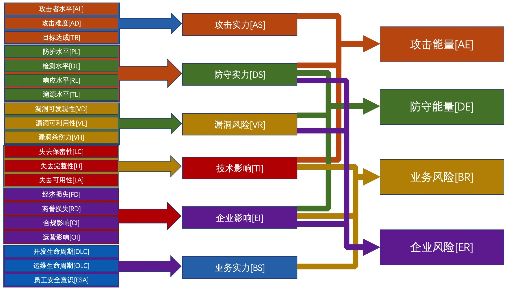

# **红蓝对抗演练评分系统 - RTASS**

> Red Teaming Assessment Scoring System ( RTASS )
> 
> 维护者: Monyer@JD.Army
> 协作者: Members@JD.Army, vf3ng@JD
> 
> RTASS在线评分工具: <https://jd.army/RTASS/?lang=cn>

红蓝对抗演练评分系统（RTASS）是一个开放式框架，用来评估单次网络红蓝对抗或实战演习中的攻防双方能力投入情况，以及涉及业务及所在企业所面临的风险程度。

RTASS由京东蓝军创建、拥有和进行管理。京东蓝军是京东集团成立的专注于挖掘和解决企业安全运行风险隐患的专业型APT团队。京东蓝军保留自行决定定期更新RTASS和本文档的权利。虽然京东蓝军拥有RTASS的所有权利和利益，但它许可公众自由使用，遵循Apache开源协议。

## **更新日志**
- v0.1.4, 2021-11-09, 更新了RTASS因子描述以及框架白皮书
- v0.1.3, 2021-11-08, 更新了评分描述以及框架白皮书
- v0.1.2, 2021-11-05, 更新了评分维度
- v0.1.0, 2021-11-04, 创建

## **背景**
多年以前，企业通常仅靠采用“渗透测试”挖掘单个应用系统漏洞的方式来评估自身安全。为了评估漏洞的危害性，美国国家基础设施顾问委员会（NIAC）开发了一套通用漏洞评估系统CVSS，并交由事件响应和安全团队论坛（FIRST）进行托管。FIRST在前序版本基础上，又继续迭代了v2和v3版本，针对单个漏洞的危害性评估标准越来越精确和完善，也被各大安全组织和漏洞收录平台所使用。

随着网络安全的发展，面临的网络威胁与日俱增，通过模拟黑客APT攻击手段与行为，对企业开展综合性安全评估的红蓝对抗实战演习方式开始被广泛采用。有些组织单位为了对攻击方之间以及防守方之间进行评估，也制定了一些评分制度。但这种评分制度只能衡量攻击方与攻击方之间，防守方与防守方之间的差异，科学性也有待商榷，也无法做攻击队与防守队间的能力对比。而在仅有一支攻击队伍和一支防守队伍的情况下，问题则更加突出：如果核心系统被突破，那么是说明攻击队伍强，还是说明防守队伍弱呢？如果核心系统没有被突破，那么是攻击队伍弱，还是防守队伍强呢？这是非常难衡量的，业内也没有一套成熟的体系来进行评价。因此京东蓝军结合多年网络实战攻防演习以及红蓝对抗经验，参考CVSS以及OWASP风险评级方法，开发了这套针对实战演习场景下的红蓝对抗评分框架。

## **介绍**
RTASS（Red Teaming Assessment Scoring System）是一套针对红蓝双方对抗式网络实战攻防演练中，攻击方、防守方、业务方以及企业风险进行评分的框架。

RTASS适用于网络红蓝对抗演练、网络实战攻防演习、红队评估、蓝军评估等通过模拟黑客APT手段对企业开展实网攻击的安全评估场景。

目前版本，RTASS通过20项评估因子形成6个中间分值。中间分值再通过不同组合，形成针对攻击方、防守方、业务以及企业等不同角色的四项最终分值：攻击能量、防守能量、业务风险和企业风险。这四项分值均指代在单次演练中的情况，因此在不同的演练中，分值可能会有所不同。

- 攻击能量是攻击方在单次演练中做的有效输出，可代表攻防方之于本次演练的水平；
- 防守能量是防守方在单次演练中的有效输出，可代表防守方之于本次演练的水平；
- 业务风险指业务在安全上暴露的风险程度，可代表参演业务方在本次演练中的安全水平；
- 企业风险指企业在安全上暴露的风险程度，可代表企业整体上在本次演练中表现出的安全水平。

## **方法**
框架整体上由“攻防因素”与“业务（影响）因素”两大类别构成。
攻防因素主要是从攻击以及防守角度上去衡量各自的强度，对渗透路径中的关键漏洞的杀伤力进行评价，最终结合业务因素形成“攻击能量”和“防守能量”分值。

业务因素主要是是从可对企业造成的影响，业务安全能力水平，以及CIA信息安全三要素角度进行评价，最终结合攻防因素形成“业务风险”和“企业风险”分值.

我们以攻击因素为例：

 - 攻击实力指攻击方在单场次红蓝对抗演练中，在**关键渗透路径**上使用攻击技术的**最高水平**
 - 防守实力指防守方在单场次红蓝对抗演练中，在**关键渗透路径**上使用防守技术的**最高水平**
 - 漏洞风险指在单场次红蓝对抗演练中，在演练的**关键渗透路径**上对**最关键漏洞**的风险性评价

为什么一定是“关键路径”和“最高”、“最关键”呢？

这是因为在单场次红蓝对抗当中，攻击者能够采取不同的战略形成不同的攻击路径，并在攻击路径中使用数十、上百种不同的TTPs。如果依次针对这些TTPs进行衡量，很明显是不现实的，也大幅增加了评估的工作量。

安全遵循“短板原理”，同样也遵循“长板原理” —— 攻击者不需要保证每一次TTPs的投入都是最高的技术能力，只要在关键路径上有一次或几次的高水平，就有可能把企业目标拿下。
所以我们以攻击者在攻击关键路径上投入的最高水平作为他们的攻击实力的表现。

显然，我们也能看出：攻击者实力并不能代表攻击者在单次红蓝对抗演练中的总的有效技术投入。我们拿物理学做个比喻：一个人在一个物体上施加的最大力，并不能代表这个人在物体上做的有效功。所以，为了衡量攻击者的“功”，我们引入“攻击能量”概念，用以表示攻击者在单次红蓝对抗演习中的总有效投入，也即攻击者在本次演练中投入的技术水平。

在目前版本中:

- “攻击能量”与“攻击实力”、“防守实力”、“企业影响”有正向关系。

- “防守能量”与“防守实力”有正向关系，与“漏洞风险”、“企业影响”有反向关系。

- “业务风险”与“技术影响”、“企业影响”有正向关系，与“业务实力”有反向关系。

- “企业风险”与“防守实力”有反向关系，与“漏洞风险”、“企业影响”有正向关系。

当然，上述关联也有可能随着RTASS的进化有所改变，目前各因子、因素之间的系数绝对值均为1，后续也有可能根据更新的理念发生变化。

在本评分框架中，每个因子都有0到10共11个评分项。而单个因素的得分与最终四项总分值也都是这个原则：最低分0分，最高分为10分。其中，各等级的分布如下：

| 分值 | 等级 |
| --- | --- |
- 0.00分，无
- 0.01-2.99分，低
- 3.00-5.99分，中
- 6.00-7.99分，高
- 9.00-10.00分，极

分数向上取整。

现在版本的RTASS共有20个评分因子，虽然每个因子都由0到10分组成，但并非所有的分数项都有通过文字进行定义的描述，这一方面是由于有些因子本身就不具备10个评分维度，另一方面也是在框架制定过程中尚未找到更加准确的文字描述。评分者可以根据有文字描述的分值部分来进行评价，确定是否应该采取无文字描述部分评分更加妥当。我们也会在框架版本的不断演进迭代中，力争保证评分及文字描述更加准确。

> 注：本框架部分评分因子如“漏洞风险”、“企业影响”等参考借鉴了OWASP风险评级方法中相关因子。

下面将对现版本RTASS的各分值的计算、各因素和因子进行详细讲解：

### **攻击能量**

- **攻击能量 = ( 攻击实力 * 系数 + 防守实力 * 系数  + 企业影响 * 系数 ) / 3**

攻击能量指代攻击方在单次演练中做的有效的“功”。如果使用了很高级的技术，费了很大力气，但是没有取得功效，那么相当于在本次演练中做了无用功，就意味着攻击能量很低。

为了衡量攻击者的有效能力输出，我们将其与“攻击实力”、“防守实力”、“企业影响”绑定。攻击实力比较好理解，我们引入“防守实力”因素是为了校正“攻击实力”在能力上的有效展现。一般来讲，防守的实力越强，在达成同等目标的前提下，说明攻击的实力越强；反之，如果防守的实力越弱，那么为了达成目标，攻击通常可以有更少的投入。“企业影响”是用于衡量攻击者“做功”上的有效性。在单次演练中暴露的企业风险越多，说明攻击者的能量越强；反制，暴露的企业风险越少，说明攻击者在演练中的能量越小。

### **防守能量**

- **防守能量 = ( 防守实力 * 系数 + ( 10 - 漏洞因素 * 系数 ) + ( 10 - 企业影响 * 系数 ) ) / 3**

同攻击能量一样，防守能力指代防守方在单次演练中做的有效“功”。但不能简单认为“防守实力”就是防守的能量体现。因为即便防守的实力很强，如果在攻击关键路径上暴露了严重的漏洞风险，那么说明防守的实力并没有落在实处，应该予以减分。同样，即便实力很强，漏洞面也很小，但是依然能给企业带来重大的影响，说明防守产生的有效能量是不够的，要予以减分。

所以防守能量与防守实力成正比，与漏洞风险、企业影响成反比。

### **业务风险**

- **业务风险 = ( 技术影响 * 系数 + 企业影响 * 系数 + ( 10 - 业务实力 * 系数 ) ) /3**

如果关键系统在技术影响上的问题较大，则说明在保密性、完整性和可用性这三大信息安全维度上出现了较大问题；如果是能够给企业带来较大的影响，不管是经济损失、商誉损失还是合规影响、运营影响，那么都会较大程度上影响企业的发展；而如果是因为SDL或者是DevSecOps的落实上出现了问题，那么将会在安全的推进以及风险的消除上带来较大的阻碍。

也就是说，当业务系统受到威胁后，技术影响越大、企业影响越大、暴露的安全能力越差，说明业务面临更大的威胁，因此业务风险与技术影响、企业影响呈正向关系，与业务实力呈反向关系。

### **企业风险**

- **企业风险 = ( ( 10 - 防守实力 * 系数 ) + 漏洞风险 * 系数 + 企业影响 * 系数 ) / 3**

一个企业如果在安全建设上的投入不大，一般会直接作用在防护能力、检测能力和响应能力上，即防守实力上。反之，如果企业防守实力弱，那么说明企业在安全建设或者防守团队建设上面临问题，将使企业面临更多的风险；演练中，在关键的渗透路径上的关键漏洞是非常容易发现的、非常容易利用的，并且杀伤力极大的，一般其实说明防守在日常的安全运营和SDL或DevSecOps的安全流程落地上出现了比较大的问题和隐患，企业的安全性出现较大问题；而“企业影响”更是影响到企业的正常运营、营收甚至是生死存亡。

因此，企业风险分值与防守实力呈反向关系，防守实力越弱，企业风险越高；与漏洞风险、企业影响呈正向关系，漏洞风险越大、企业影响越大，则企业风险越高。

## **评分因素**
### **攻防因素**

攻击因素由攻击实力、防守实力、漏洞因素三部分组成

#### **攻击实力**

攻击实力由攻击者水平、攻击难度、目标达成情况三个因子计算得出，计算方法为：

- 攻击实力 = ( 攻击者水平 * 系数 + 攻击难度 * 系数 + 目标达成 * 系数 ) / 3

##### **攻击者水平**

主要评估本次演练，攻击者在评估路径中使用的最高技术水平？
- 0 - N/A
- 1 - 相当于入门级黑客
- 2 - 相当于能够熟练使用一些工具的黑客
- 3 - 相当于能够简单写一些小脚本的黑客
- 4 - 相当于普通技术水平的黑客
- 5 - 相当于可以自写利用程序或挖掘漏洞的黑客
- 6 - 等同精通渗透技术黑客
- 7 - 需要一定的团队配合
- 8 - 较为专业的技术团队
- 9 - 专业的APT级黑客团队
- 10 - 国家级APT黑客团队

##### **攻击难度**

主要评估本次演练，攻击者在整个评估路径中搞定难题的最高难度？
- 0 - N/A
- 1 - 几乎没有难度
- 2
- 3 - 有点难度
- 4
- 5 - 较大难度
- 6 
- 7 - 
- 8 - 很难搞定
- 9 - 
- 10 - 几乎不能搞定

##### **目标达成**

主要评估本次演练，攻击者是否达成预期目标？
- 0 - N/A
- 1 - 基本没达成
- 2
- 3 - 少量达成
- 4
- 5
- 6
- 7 - 大量达成
- 8
- 9 - 完全达成
- 10 - 超额达成

一般来说，我们要求在演练目标的制定上一定要设定企业重要的核心系统，在目标完全被拿下的情况下，可以对企业造成非常严重影响。

#### **防守实力**

防护实力由防护水平、威胁监测水平、应急响应水平、溯源反制水平四个因子计算得出，计算方法为：

- 防护实力 = ( 防护水平 * 系数 + 监测水平 * 系数 + 响应水平 * 系数 + 反制水平 * 系数 ) / 4

##### **防护水平**

主要评估本次演练，防守者对关键渗透路径的拦截能力？
- 0 - N/A
- 1 - 几乎没有拦截
- 2
- 3 - 轻微的拦截
- 4
- 5
- 6
- 7 - 较强的拦截
- 8
- 9 - 
- 10 - 几乎难以突破

##### **监测水平**

主要评估本次演练，防守者对关键渗透路径的网络威胁发现能力？
- 0 - N/A
- 1 - 几乎难以监测到威胁
- 2
- 3 - 监测到周边攻击威胁
- 4
- 5 - 监测到少量关键路径威胁
- 6
- 7 - 监测到大量关键路径威胁
- 8
- 9 - 
- 10 - 几乎监测到全部威胁

##### **响应水平**

主要评估本次演练，防守者对沦陷系统的恢复能力、修复能力和应急响应能力？
- 0 - N/A
- 1 - 几乎难以推进（一周以上）
- 2
- 3 - 响应较为缓慢（24小时以上）
- 4
- 5
- 6 - 响应较为及时（24小时内）
- 7
- 8 - 响应接近实时（2小时内）
- 9 - 
- 10 - 实时响应（30分钟内）

从PDR的公式，我们知道当：

> Pt > Dt + Rt,  

不等式成立时，即“防御时间 > 监测时间 + 响应时间”时，证明防守者的应急响应是成功的。在对防御时间的确定上，我们根据多年实战攻防演习经验，估算了一个区间：一般来说，攻击者进行横向移动的时间在30分钟到8小时左右。因此如果响应时间比30分钟还小，那么防守者基本上可以在攻击者进一步开展横向移动时，将攻击者踢出系统。同样，如果防守者响应时间大于8小时，在对系统进行响应时，通常攻击者已经横向移动到了企业内网的其他位置。

当然，这个时间还有待商榷，各框架使用者可以根据企业自身情况进行动态调整。

##### **溯源水平**

主要评估本次演练，防守者是否能够对攻击者进行有效溯源？
- 0 - N/A
- 1 - 几乎不能有效溯源
- 2
- 3 - 可以找到攻击者使用的DNS、C2等信息
- 4
- 5 - 可以找到攻击者的横向移动路径
- 6
- 7 - 可以找到攻击者的部分真实IP或境内虚拟身份
- 8 - 可以直接找到攻击者的真实身份
- 9 - 
- 10 - 可以对攻击者进行成功反制

#### **漏洞风险**

漏洞风险由漏洞的可发现性、可利用性以及杀伤力三个因子计算得出，计算方法为：

- 漏洞风险 = ( 漏洞可发现性 * 系数 + 漏洞可利用性 * 系数 + 漏洞杀伤力 ) / 3

##### **漏洞可发现性**

主要评估本次演练，渗透路径中的关键漏洞的可发现性？
- 0 - N/A
- 1 - 几乎难以发现
- 2
- 3 - 困难
- 4
- 5 - 中等
- 6
- 7
- 8 - 简单
- 9 - 
- 10 - 可用的自动化工具

##### **漏洞可利用性**

主要评估本次演练，渗透路径中的关键漏洞的可利用性？
- 0 - N/A
- 1 - 几乎难以利用
- 2
- 3 - 困难
- 4
- 5 - 中等
- 6
- 7 - 简单
- 8
- 9 - 
- 10 - 可用的自动化工具

##### **漏洞杀伤力**

主要评估本次演练，渗透路径中的关键漏洞的最大杀伤力？
- 0 - N/A
- 1 - 几乎没啥危害
- 2
- 3 - 低危
- 4
- 5 - 中危
- 6
- 7 - 高危
- 8
- 9 - 严重
- 10 - 极其严重
### **业务因素**

业务因素由技术影响、企业影响、业务影响三部分组成
#### **技术影响**

技术影响由CIA安全三要素组成，即保密性、完整性、可用性，并成反向关系，计算方法为：

- 技术影响 = ( 失去保密性 * 系数 + 失去完整性 * 系数 + 失去可用性 * 系数 ) / 3

##### **失去保密性**

主要评估本次演练，可以披露多少数据以及它的敏感度如何？
- 0 - N/A
- 1
- 2 - 获取最少的非敏感数据
- 3 - 获取少量数据
- 4
- 5
- 6 - 获取最少的敏感数据或大量非敏感数据
- 7 - 获取大量关键数据
- 8
- 9 - 
- 10 - 获取全部敏感数据

##### **失去完整性**

主要评估本次演练，有多少数据可能被损坏，损坏程度如何？
- 0 - N/A
- 1 - 最小的轻微损坏数据
- 2
- 3 - 最少的严重损坏数据
- 4
- 5 - 广泛的轻微损坏的数据
- 6
- 7 - 大量严重损坏的数据
- 8 - 
- 9 - 
- 10 - 所有数据完全损坏

##### **失去可用性**

主要评估本次演练，可能会丢失多少服务，它有多重要？
- 0 - N/A
- 1 - 最少的二级服务中断
- 2
- 3
- 4
- 5 - 最少的主要或广泛的次要服务中断
- 6
- 7 - 广泛的主要服务中断
- 8
- 9 - 
- 10 - 所有服务完全丢失

#### **企业影响**

企业影响由演练成果所能造成最大危害所引起的：经济损失、商誉损失、合规影响和运营影响四个因子计算得出，计算方法为：

- 企业影响 = ( 经济损失 * 系数 + 商誉损失 * 系数 + 运营影响 * 系数 + 运营影响 * 系数 ) / 4

##### **经济损失**

主要评估本次演练，可对企业经济造成的最大影响？
- 0 - N/A
- 1 - 低于修复漏洞的成本
- 2
- 3 - 对年利润影响不大
- 4
- 5
- 6
- 7 - 对年度利润的显著影响
- 8
- 9 - 
- 10 - 破产

##### **商誉损失**

主要评估本次演练，是否会导致企业声誉受损从而损害业务？
- 0 - N/A
- 1 - 最小的伤害
- 2
- 3
- 4 - 大客户或大量客户流失
- 5 - 商誉损失
- 6
- 7
- 8
- 9 - 品牌损害
- 10 - 品牌不可逆损害

##### **合规影响**

主要评估本次演练，出现的问题或攻击者进行恶意行动会带来多少违规风险？
- 0 - N/A
- 1
- 2 - 轻微违规
- 3
- 4
- 5 - 明显违规
- 6
- 7 - 高调违规
- 8
- 9 - 
- 10 - 严重违法

##### **运营影响**

主要评估本次演练，攻击者进行恶意行动是否影响企业的正常运营？
- 0 - N/A
- 1
- 2
- 3 - 影响少量非核心系统运营
- 4
- 5 - 影响部分重要系统运营
- 6
- 7 - 影响大量核心系统正常运营
- 8
- 9 - 
- 10 - 企业运营基本停止

#### **业务实力**

从系统及应用风险面来看，安全会较多地体现在安全性需求设计、安全编码、安全测试、安全运维、安全防护、应急响应、安全意识、终端防护、安全架构、安全管理、现实安保、供应链安全等方面。其中安全性需求设计、安全编码、安全测试、安全架构属于开发生命周期范畴，安全运维、终端防护、安全管理都属于运维生命周期范畴。安全意识、现实安保属于员工安全意识范畴。安全防护、应急响应属于安全运营团队的PDR范畴。

所以在对业务实力进行评价时，我们刨除掉安全运营团队（防守方）因素，分成安全开发生命周期、安全运维生命周期和员工安全意识三个因素。计算方法为：

- 业务实力 = ( 开发生命周期 * 系数 + 运维生命周期 * 系数 + 员工安全意识 ) / 3

##### **开发生命周期**

主要评估本次演练，是否发现在软件开发生命周期中存在安全问题？
- 0 - N/A
- 1 - 基本上在开发过程中没有考虑安全问题
- 2
- 3 - 有较多的安全流程问题
- 4
- 5
- 6
- 7 - 有一定的安全流程问题
- 8
- 9 - 
- 10 - 几乎没有安全流程问题

##### **运维生命周期**

主要评估本次演练，是否发现在运维生命周期中存在安全问题？
- 0 - N/A
- 1 - 基本上在运维过程中没有考虑安全问题
- 2
- 3 - 有较多的安全流程问题
- 4
- 5
- 6
- 7 - 有一定的安全流程问题
- 8
- 9 - 
- 10 - 几乎没有安全流程问题

##### **员工安全意识**

主要评估本次演练，在评估过程中大部分员工是否有安全意识问题？
- 0 - N/A
- 1 - 几乎全员没有任何安全意识
- 2 - 大部分关键岗位员工安全意识较弱
- 3 - 大部分员工安全意识较弱
- 4 - 少部分关键岗位员工安全意识较弱
- 5
- 6
- 7 - 少部分员工安全意识较弱
- 8
- 9 - 
- 10 - 全部员工基本上都有极高的安全意识

## **参考链接**
- https://owasp.org/www-community/OWASP_Risk_Rating_Methodology
- https://www.first.org/cvss/specification-document#i5
- https://en.wikipedia.org/wiki/Common_Vulnerability_Scoring_System

## **协作 & 贡献**

本框架采用JSON格式进行了系统描述，详见“/src/RTASS.json”文件，其中：
- 20个评分因子放于“factors”对象中，包括每个因子的0到10的分值描述
- 6个评分因素通过“factorGroups”进行描述，其中“weight”对象存储评分系数，系数为位于0-1之间的小数，并且系数的绝对值之和要等于评分因子的数量。当系数为正数时，为正相关；系数为负数时为负相关。
- 4个最终得分通过“scoring”进行描述，其中“weight”对象存储评分系数，具体方式与上相同
- “levels”对象存储分值与高中低之前的对应关系。

各协作者可以通过修改RTASS.json文件对各评分因子的描述以及评分权值来与我们进行该系统框架的协作开发。

# **RTASS在线计算器系统截图**

