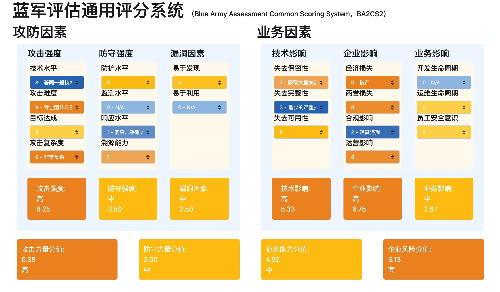

# RTASS - 红队评估评分系统
> Red Teaming Assessment Scoring System

## 更新日志
v0.1.2, 2021-11-05, 更新了评分维度
v0.1.0, 2021-11-04, 创建

## 背景
在很多年以前，企业评估自身安全通常仅靠采用渗透测试挖掘单个应用系统漏洞来进行。为了评估漏洞的危害性，美国国家基础设施顾问委员会（NIAC）开发了一套通用漏洞评估系统CVSS，并交由事件响应和安全团队论坛（FIRST）进行托管。FIRST 在前序版本基础上，又继续迭代了v2和v3版本，针对单个漏洞的危害性评估标准越来越完善，也被各大漏洞收录平台和组织所使用。

随着网络安全的发展，面临与日俱增的威胁，通过模拟黑客APT手段行为，对企业开展网络安全评估的实战攻防演习方式开始进入人们视野。有些组织单位为了对攻击方之间以及防守方之间进行评估，也制定了一些评分制度，但这种评分制度只能衡量攻击方与攻击方之间，防守方与防守方之间的差异，并且科学性也有待商榷。而且在仅有一支攻击队伍和一支防守队伍的情况下，那么如果核心系统被搞定是说明攻击队伍强，还是说明防守队伍弱呢？如果核心系统没有被拿下，那么是攻击队伍弱，还是防守队伍强呢？这是非常难衡量的，业内也没有一套成熟的体系来进行评价，因此我们结合业内的网络实战攻防演习以及红蓝对抗经验，参考CVSS以及OWASP风险评级方法，开发了这套针对实战演习场景下的评分体系。

## 介绍
RTASS是一套针对网络实战攻防演练或网络红蓝对抗环节对攻击方、防守方、业务方以及企业整体情况进行评分的框架。下面将对框架的每一个部分进行描述。

## 方法
框架整体上由“攻防因素”与“业务（影响）因素”两大类别构成。
攻击因素主要是从攻击以及防守角度上去衡量各自的强度，以及对渗透路径中的关键漏洞的杀伤力进行评价，并最终形成“攻击力量分值”和“防守力量分值”。

### 攻击能量分值

- **攻击能量分值 = ( 攻击强度 * 系数 + ( 9 - 漏洞因素 * 系数 ) + 企业影响 * 系数 ) / 3**

攻击能量指代攻击方在本次评估中做的有效的“功”，如果使用了很高级的技术，费了很大力气。

因此应该由投入的技术“数量”*技术“质量”所决定。

在不同的攻击行动中，由于防守单位主体的系统安全建设、安全流程的落实，以及运营团队的能力水平不同，攻击方达成目标所需要投入的能力也会有很大的不同。此外如果企业存在非常低级的严重漏洞，那么攻击能力就可以很小，反之就可以很大

### 防守能量分值

- **防守能量分值 = ( 防守强度 * 系数 + ( 9 - 漏洞因素 * 系数 ) + ( 9 - 企业影响 * 系数 ) ) / 2**

同攻击能力分值的计算一样，当漏洞分值越高，说明漏洞在更易于发现、易于利用，或杀伤力非常大，说明防守是没有在漏洞上投入太大能量的，所以成反向关系。

### 业务风险分值

- **业务风险分值 = ( 技术影响 * 系数 + 企业影响 * 系数 + 业务影响 * 系数 ) /3**

业务系统受到威胁后，技术影响越大、企业影响越大、业务影响越大，说明业务面临更大的威胁，因此业务风险分值与技术影响、企业影响和业务影响三个维度呈现正相关。

### 企业风险分值

- **企业风险分值 = ( 防守强度 * 系统 + 企业影响 * 系数 ) / 2**

一个企业的风险分值越大，那么说明该企业的防护能力越差，可能导致的企业影响越大。而反过来讲，企业防护能力越好，企业影响越小，那么该企业的风险必然是越低，呈现正相关。

## 因素
### 攻防因素

攻击因素由攻击强度、防守强度、漏洞因素三部分组成，计算方法为：

#### 攻击强度

##### 技术水平

##### 攻击难度

##### 目标达成

##### 攻击复杂度

#### 防守强度

##### 防护水平

##### 监测水平

##### 响应水平

##### 溯源能力

#### 漏洞因素

##### 易于发现

##### 易于利用

##### 漏洞杀伤力

### 业务因素

#### 技术影响

##### 失去保密性

##### 失去完整性

##### 失去可用性

#### 企业影响

##### 经济损失

##### 商誉损失

##### 合规影响

##### 运营影响

#### 业务影响

##### 开发生命周期

##### 运维生命周期

##### 员工安全意识

## 参考链接
- https://owasp.org/www-community/OWASP_Risk_Rating_Methodology
- https://www.first.org/cvss/specification-document#i5

# RTASS在线计算器

访问链接: https://jd.army/RTASS/?lang=cn

系统截图：

