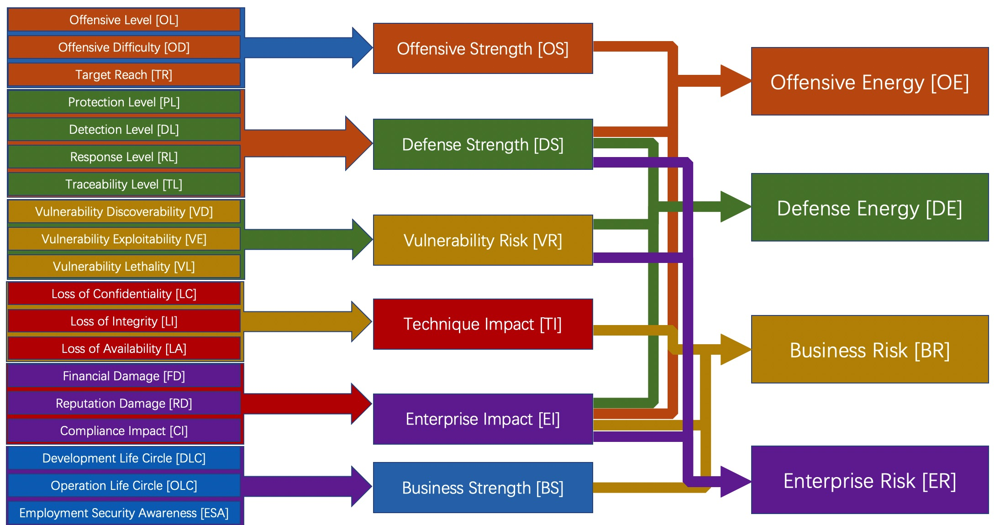
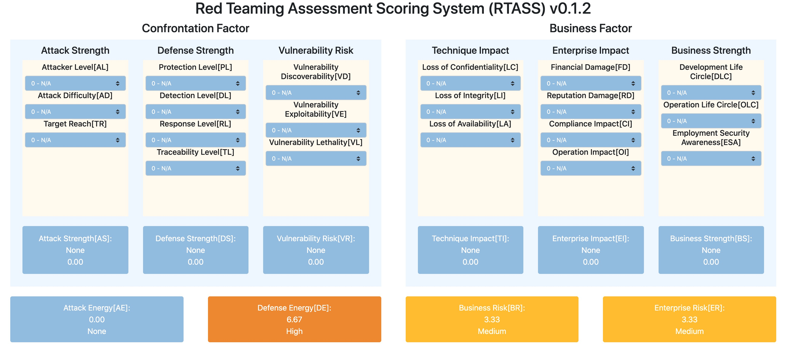

# **Red Teaming Assessment Scoring System - RTASS**

> Red Teaming Assessment Scoring System ( RTASS )
> 
> Maintainer: Monyer@JD.Army
> Contributors: Members@JD.Army, vf3ng@JD
> 
> RTASS online calculator tool: <https://jd.army/RTASS/?lang=cn>

Red Teaming Assessment Scoring System (RTASS) is an open framework, for scoring the capability input on both sides of attack and defense in a single cyber actual combat confrontation exercise, as well as the degree of risk faced by the business and the enterprise. 
 
RTASS is founded, owned, and managed by the JD.Army team. .Army is a professional red team which focuses on excavating and solving the hidden security risks of enterprise safe operation. JD.Army reserves the right to update RTASS and this document regularly at its sole discretion. Although JD.Army owns all the rights and interests in RTASS, it permits the public to use it freely and follows the Apache open source agreement.

## **Change Log**
- v0.2.2, 2021-11-15, RTASS key modified, wrote English doc
- v0.2.1, 2021-11-12, Updated
- v0.1.0, 2021-11-04, Created

## **Background**
Many years ago, the enterprise usually used "penetration testing" to explore each single application system's vulnerabilities to evaluate their own security. In order to evaluate the harmfulness of the vulnerability, the National Infrastructure Advisory Council (NIAC) developed the Common Vulnerability Scoring System (CVSS) framework and selected the Forum of Incident Response and Security Teams (FIRST) to become the custodian of CVSS for future development. On the basis of the previous version, FIRST continues to iterate over v2 and v3 versions, evaluating and scoring for vulnerability is gradually improved, and is also widely used by major security organizations and vulnerability collection platforms.

With the development of network security, network threats are increasing day by day. By simulating the means and behavior of hackers' APT attacks, the red-blue confrontation exercises for comprehensive security assessment of enterprises have been widely used. In order to evaluate between attackers and defenders, some organizational units have also developed some scoring systems. However, this scoring system can only measure the difference between the attacking teams, and the difference between the defender teams. The scientificity is also open to question, and it is impossible to make a comparison of the ability between the attacking team and the defensive team. When there is only one attacking team and one defensive team, the problem is even more prominent: if the core system is breached, does it mean that the attacking team is stronger, or that the defensive team is weaker? If the core system is not breached, is the attacking team weaker or the defensive team stronger? This is very difficult to measure, and the industry does not have a mature system to evaluate. Therefore, the JD.Army develop this Red Teaming Assessment Scoring System (RTASS) framework for actual combat exercise scenarios based on years of cyber actual offensive and defensive exercises and red-blue confrontation experience, with reference to the CVSS and OWASP risk rating methods.

## **Introduction**
RTASS is a framework for scoring the attacker and defender's output, business and enterprise risk during the red teaming assessment. Which work be presented by simulating the means and behavior of hackers' APT attacks.

RTASS is suitable for red teaming assessment, red-blue confrontation exercises, cyber actual offensive, defensive exercises, and blue army assessment, etc. Which 

In the current version, RTASS forms 6 process scores through evaluation factors. The process scores are then combined through different combinations to form 4 final scores for different roles such as the attacker, the defender, the business, and the enterprise: **offensive energy**, **defense energy**, **business risk** and **enterprise risk**.

- **Offensive energy** is the effective output of the attacker in a single exercise, which can represent the level of the attacker in this exercise;
- **Defensive Energy** is the effective output of the defender in a single exercise, which can represent the level of the defender in this exercise;
- **Business risk** refers to the degree of risk that the business units exposes to security, which can represent the security level of the participating business units in this exercise;
- **Enterprise risk** refers to the degree of risk that an enterprise exposes to security, which can represent the security level of the enterprise as a whole in this exercise.

These four scores all refer to the situation in one single exercise, so the scores may be different in different exercises.
The scoring factors and algorithms will be introduced in detail below.

## **Methods**
RTASS is composed of two major categories: confrontation factors and business factors.

confrontation factors are mainly to measure the strengths of attack and defense, evaluate the lethality of key vulnerability in the penetration path, and finally combine business factors to form "offensive energy" and "defense energy" scores.

Business factors are mainly evaluated from enterprise impact, business strength, and the CIA information security three elements, and finally combine confrontation factors to form "business risk" and "enterprise risk" scores.

Let's take the confrontation factors as an example:

- **Offensive Strength** refers to the **highest level** of attack technology used by the attacker on the **critical penetration path** in a single red-blue confrontation exercise.
- **Defensive strength** refers to the **highest level** of defensive technology used by the defender on the **critical penetration path** in a single red-blue confrontation exercise.
- **Vulnerability risk** refers to the risk evaluation of the **most critical vulnerability** on the **critical penetration path** in a single red-blue confrontation exercise

Why "critical path", "highest level" and "most critical" must be needed?

This is because, in a single red-blue confrontation, the attacker can adopt different strategies to form different attack paths and use dozens or hundreds of different TTPs in the attack path. It is obviously unrealistic to measure these TTPs in turn, and it also greatly increases the workload of the evaluation.

Security follows the "shortboard principle" as well as the "longboard principle" - the attacker does not need to ensure that every TTPs investment is the highest technical capability, as long as there is a high level of one or several times on the critical path, It is possible to take down the goals.

Therefore, we take the highest level of attackers' investment in the critical path of the attack as the performance of their attacking power.

Obviously, we can also see that the strength of the attacker does not represent the total effective technical output of the attacker in a single red-blue confrontation exercise. Let us use physics as an analogy: the maximum force a person exerts on an object does not represent the effective work that a person does on the object. Therefore, in order to measure the "power" of the attacker, we introduce the concept of "offensive energy" to indicate the total effective investment of the attacker in a single red-blue confrontation exercise, that is, the technical level of the attacker's investment in this exercise.

In the current version:

- "Offensive energy" has a positive relationship with "offensive strength", "defensive strength", and "enterprise impact".
- "Defensive energy" has a positive relationship with "defensive strength" and a negative relationship with "vulnerability risk" and "enterprise impact".
- "Business risk" has a positive relationship with "technical impact" and "enterprise impact", and has a negative relationship with "business strength".
- "Corporate risk" has a negative relationship with "defensive strength", and has a positive relationship with "vulnerability risk" and "enterprise impact".

Of course, the above-mentioned association may also change with the evolution of RTASS. At present, the modulus of each factor and factor is all 1, and it may also change according to the updated concept in the future.

In this scoring framework, each factor has 6 scoring items from 0 to 5. In the process score and the final score: the lowest score is 0 points, the highest score is 10 points. Among them, the distribution of the corresponding grades of each score is as follows:

| Points            | Level   |
| ----------------- | ------- |
| 0.00 points       | None    |
| 0.01-3.99 points  | low     |
| 4.00-6.99 points  | medium  |
| 7.00-8.99 points  | high    |
| 9.00-10.00 points | Extreme |

> Note: Some of the scoring factors in this framework, such as "vulnerability risk" and "enterprise impact", refer to relevant factors in the OWASP risk rating method.

The calculations, factors of the current version of RTASS will be explained in detail below:

### **Offensive Energy[OE]**

- **Offensive Energy = ( Offensive Strength * modulus + Defensive Strength * modulus  + Enterprise Impact * modulus ) / 3**

Offensive energy refers to the effective "work" done by the attacker in a single exercise. If very advanced technology is used and a lot of effort is used, but no effect is achieved, then it is equivalent to doing useless work in this exercise, which means that the offensive energy is very low.

To measure the effective output of an attacker, we bind it to "offensive strength", "defensive strength", and "enterprise risk". Offensive strength is easier to understand. We introduce the "defensive strength" factor to correct the effective display of "offensive strength" in ability. Generally, the stronger the defensive is, the stronger the offensive is on the premise of achieving the same goal; conversely, if the defender is weaker, then the attacker can usually have less investment in order to achieve the goal. "Enterprise impact" is used to measure the effectiveness of the attacker's "work". The more enterprise risks exposed in a single exercise, the stronger the attacker's energy; the fewer countermeasures, the fewer enterprise risks exposed, the smaller the attacker's energy during the exercise.

### **Defensive Energy**

- **Defensive Energy = ( Defensive Strength * modulus + ( 10 - Vulnerability Risk * modulus ) + ( 10 - Enterprise Impact * modulus ) ) / 3**

Like offensive energy, defensive energy refers to the effective "work" done by the defender in a single exercise. But you cannot simply think that "defensive strength" is the manifestation of defensive energy. Because even if the defensive strength is very strong, if a serious vulnerability risk is exposed on the critical path of the attack, it means that the defensive strength has not been implemented and points should be reduced. Similarly, even if the strength is strong and the vulnerabilities are small, it can still have a significant impact on the company, indicating that the effective energy generated by the defense is not enough, and points should be reduced.

Therefore, defensive energy is directly proportional to defensive strength and inversely proportional to vulnerability risk and enterprise impact.

### **Business Risk**

- **Business Risk = ( Technical Impact * modulus + Enterprise Impact * modulus + ( 10 - Business Strength * modulus ) ) /3**

If the key system has a large technical impact, it means that there are large problems in the three dimensions of information security, confidentiality, integrity, and availability; if it can bring a greater impact to the enterprise, whether it is Financial Damage, Reputation Damage, or compliance impact, will all affect the development of the company to a greater extent; and if there is a problem with the implementation of SDL or DevSecOps, then security will be promoted and risks eliminated. Bring greater obstacles.

That is to say when the business system is threatened, the greater the technical impact, the greater the enterprise impact, and the worse the exposed security capabilities, indicating that the business faces greater threats. Therefore, business risks have a positive relationship with technical impacts and enterprise impacts. Business strength is inversely related.

### **Enterprise Risk**

- **Enterprise Risk = ( ( 10 - Defensive Strength * modulus ) + Vulnerability Risk * modulus + Enterprise Impact * modulus ) / 3**

If an enterprise does not invest much in security construction, it will generally directly affect its defense capabilities, detection capabilities, and response capabilities, that is defense capabilities. Conversely, if the company’s defensive strength is weak, it means that the company is facing problems in security construction or defensive team building, which will expose the company to more risks. During the exercise, if the key vulnerabilities in the key penetration path are very easy to find and very easy to use, and extremely lethal, it generally means that the defense has encountered relatively large problems and hidden risks in security operations and the implementation of SDL or DevSecOps security processes, and the security of the enterprise has major problems; and "enterprise Impact" even affects the normal operation, revenue and even survival of the enterprise.

Therefore, the Enterprise risk score has an inverse relationship with defensive strength. The weaker the defensive strength, the higher the Enterprise risk is; the positive relationship with the vulnerability risk and Enterprise impact. The greater the vulnerability risk and Enterprise impact, the higher the Enterprise risk is.

## **Scoring factors**
### **Confrontation factors**

Offensive factors are composed of three parts: offensive strength, defensive strength, and vulnerability risk factors.

#### **Offensive Strength[OS]**

Offensive Strength is calculated by three factors: offensive level, offensive difficulty, and target reach. The calculation algorithm is:

- **Offensive Strength = ( Offensive Level * modulus + Offensive Difficulty * modulus + Target Reach * modulus ) / 3**

##### **Offensive Level[OL]**

In this assessment, The highest level of attack technology used in the assessment path?
- 0 - N/A
- 1 - Equivalent to entry-level hackers
- 2 - Equivalent to ordinary level hackers or tools, script hackers
- 3 - Equivalent to hackers proficient in penetration technology
- 4 - Need more professional team cooperation
- 5 - Equivalent to a national APT hacker team

##### **Offensive Difficulty[OD]**

In this assessment, The highest difficulty in solving problems in the entire evaluation path?
- 0 - N/A
- 1 - Almost no difficulty
- 2 - A bit difficult
- 3 - More difficult
- 4 - Very Difficult
- 5 - Hardly handle

##### **Target Reach[TR]**

In this assessment, Has the expected goal been achieved?
- 0 - N/A
- 1 - Basically not reached
- 2 - A small amount
- 3 - Medium amount
- 4 - Mass reached
- 5 - Fully achieved

Generally, we require that some important core systems of the enterprise must be set in the formulation of the exercise goal. When the goals are fully achieved, there will be a very serious impact on the enterprise.

#### **Defensive Strength[DS]**

Defensive Strength is calculated by four factors: prevention level, detection level, response level, and traceability level. The calculation algorithm is:

- **Defensive Strength = ( Prevention Level * modulus + Detection Level * modulus + Response Level * modulus + Traceability Level * modulus ) / 4**

##### **Prevention Level[PL]**

In this assessment, Ability to intercept critical paths in the assessment process?
- 0 - N/A
- 1 - Almost no interception
- 2 - Slightly intercepted
- 3 - Strong interception
- 4 - Very strong interception
- 5 - Almost hard to breakthrough

##### **Detection Level[DL]**

In this assessment, The ability to detect cyber threats on critical paths in the assessment process?
- 0 - N/A
- 1 - Hardly detect threats
- 2 - Peripheral attack threat detected
- 3 - A small number of critical path threats detected
- 4 - A large number of critical path threats detected
- 5 - Almost all threats detected

##### **Response Level[RL]**

In this assessment, Resilience, repair, and emergency response to the occupied system?
- 0 - N/A
- 1 - Basically unable to move (More than one week)
- 2 - Slow response (more than 24 hours)
- 3 - Response is relatively timely (within 24 hours)
- 4 - Response is close to real-time (within 2 hours)
- 5 - Real-time response (within 30 minutes)

From the PDR formula, we know when:

> Pt > Dt + Rt,  

When the inequality is established, that is, "defense time> monitoring time + response time", it proves that the defender's emergency response is successful. In determining the defense time, we have estimated an interval based on years of actual offensive and defensive exercise experience: Generally, the time for an attacker to move laterally is about 30 minutes to 8 hours. Therefore, if the response time is less than 30 minutes, the defender can basically kick the attacker out of the system when the attacker further moves laterally. Similarly, if the defender's response time is greater than 8 hours when responding to the system, the attacker usually has moved laterally to other locations on the enterprise intranet.

Of course, this time remains to be discussed, and users of the RTASS framework can make dynamic adjustments according to the company's own situation.

##### **Traceability Level[TL]**

In this assessment, Whether the attacker can be traced effectively?
- 0 - N/A
- 1 - Basically cannot be traced effectively
- 2 - The DNS, C2 and other information used by the attacker can be found
- 3 - Can find the attacker's lateral movement path information
- 4 - Part of the real IP or virtual identity of the attacker can be found
- 5 - The attacker can be successfully traced and countered

#### **Vulnerability Risk**
Vulnerability Risk is calculated by three factors: Vulnerability Discoverability, Vulnerability Exploitability, Vulnerability Lethality. The calculation algorithm is:

- **Vulnerability Risk = ( Vulnerability Discoverability * modulus + Vulnerability Exploitability * modulus + Vulnerability Lethality * modulus ) / 3**

##### **Vulnerability Discoverability[VD]**

In this assessment, Discoverability of critical vulnerabilities in the penetration path?
- 0 - N/A
- 1 - Almost hard to find out
- 2 - Difficulty
- 3 - Medium
- 4 - Easy
- 5 - Automated tools available

##### **Vulnerability Exploitability[VE]**

In this assessment, Exploitability of critical vulnerabilities in the penetration path?
- 0 - N/A
- 1 - Almost hard to use
- 2 - Difficulty
- 3 - Medium
- 4 - Easy
- 5 - Automated tools available

##### **Vulnerability Lethality[VL]**

In this assessment, Maximum lethality of critical vulnerabilities in the penetration path?
- 0 - N/A
- 1 - Basically no harm
- 2 - Lower lethality
- 3 - A certain degree of lethality
- 4 - Wide range of lethality
- 5 - Extremely wide lethality

### **Business Factors**

Business factors are composed of three parts: Technical Impact, Enterprise Impact, and Business Strength
#### **Technical Impact[TI]**

Technical Impact, composed of the three factors of CIA security theory, Confidentiality, Integrity, Availability. The calculation method is:

- **Technical Impact = ( Loss of Confidentiality * modulus + Loss of Integrity * modulus + Loss of Availability * modulus ) / 3**

##### **Loss of Confidentiality[LC]**

In this assessment, How much data could be disclosed, and how sensitive is it?
- 0 - N/A
- 1 - A small amount of non-sensitive data can be disclosed
- 2 - A small amount of sensitive data can be disclosed
- 3 - A medium amount of sensitive data can be disclosed
- 4 - A large amount of sensitive data can be disclosed
- 5 - All sensitive data can be disclosed

##### **Loss of Integrity[LI]**

In this assessment, How much data could be corrupted, and how damaged is it?
- 0 - N/A
- 1 - A small amount of non-core data can be damaged
- 2 - A small amount of core data can be damaged
- 3 - A large amount of non-core data can be damaged
- 4 - A large amount of core data can be damaged
- 5 - All data can be damaged can be damaged

##### **Loss of Availability[LA]**

In this assessment, How much service could be lost, and how vital is it?
- 0 - N/A
- 1 - Can interrupt a small amount of non-core business
- 2 - Can interrupt an amount of core business
- 3 - Can interrupt a medium amount of the core business
- 4 - Can interrupt a large amount of core business
- 5 - Can interrupt almost All important business

#### **Enterprise Impact[EI]**

Enterprise Impact is caused by the maximum damage that can be caused by the exercise results: three factors of Financial Damage, Reputation Damage, and Compliance Impact are calculated. The calculation algorithm is:

- **Enterprise Impact = ( Financial Damage * modulus + Reputation Damage * modulus + Compliance Impact * modulus ) / 3**

##### **Financial Damage[FD]**

In this assessment, How much financial damage will result from this assessment?
- 0 - N/A
- 1 - Less than the cost to fix the vulnerability
- 2 - No effect on annual profit
- 3 - A certain effect on annual profit
- 4 - Significant effect on annual profit
- 5 - Huge effect on annual profit

##### **Reputation Damage[RD]**

In this assessment, Will it cause damage to the enterprise reputation and damage the business?
- 0 - N/A
- 1 - Minimal damage
- 2 - Loss of large customers or a large number of customers
- 3 - Loss of goodwill
- 4 - Brand damage
- 5 - Major brand damage

##### **Compliance Impact[CI]**

In this assessment, What is the risk of violations that arise from problems or malicious actions by an attacker?
- 0 - N/A
- 1 - Almost no violation
- 2 - Minor violation
- 3 - Clear violation
- 4 - High profile violation
- 5 - Serious violation or illegality

#### **Business Strength[BS]**

From the perspective of system and application risks, security will be more reflected in security requirements design, secure coding, security testing, security operation and maintenance, security protection, emergency response, security awareness, endpoint protection, security architecture, security management, and reality Security, supply chain security, etc. Among them, security requirements design, secure coding, security testing, and security architecture belong to the development life cycle category, and security operation and maintenance, endpoint protection, and security management all belong to the operation and maintenance life cycle category. security awareness and actual security belong to the category of employee security awareness. security protection and emergency response belong to the defensive category of the security operation team.

Therefore, when evaluating business strength, we eliminate the security operation team (defender) factor and divide it into three factors: security development life cycle, security operation, and maintenance life cycle, and employee security awareness. The calculation method is:

- **Strength = ( Development Life Circle * modulus + Operation Life Circle * modulus + Employment Security Awareness * modulus ) / 3**

##### **Development Life Circle[DLC]**

In this assessment, Are there any security issues in the software development life cycle?
- 0 - N/A
- 1 - Basically did not consider security issues
- 2 - There are more security process issues
- 3 - There are certain security process issues
- 4 - There are a small number of security process issues
- 5 - Almost no security process issues

##### **Operation Life Circle[OLC]**

In this assessment, Are there any security issues in the O&M life cycle?
- 0 - N/A
- 1 - Basically did not consider security issues
- 2 - There are more security process issues
- 3 - There are certain security process issues
- 4 - There are a small number of security process issues
- 5 - Almost no security process issues

##### **Employment Security Awareness[ESA]**

In this assessment, Do most employees have security awareness during the assessment process?
- 0 - N/A
- 1 - Almost all staff have no security awareness
- 2 - Most of the employees in key positions have weak security awareness
- 3 - A small number of employees in key positions have weak security awareness
- 4 - Most of the employees in key positions have high-security awareness
- 5 - Basically all employees have a high level of security awareness

## **Vector String**

With reference to the CVSS scoring framework, RTASS also uses "vector strings" to record the scoring process and to transmit RTASS indicator information. The RTASS vector string starts with the label "RTASS:" and the digital representation of the current version (for example 1.0.0). The indicator information appears in the form of a set of indicators, each indicator is preceded by a forward slash "/" as a separator. Each indicator is composed of an abbreviated indicator name, colon, and indicator value. The abbreviations are defined earlier in this specification (in parentheses after each factor name) and are summarized in the table below.

| Factor Name                       | Possible Values | Mandatory? |
| --------------------------------- | --------------- | ---------- |
| Offensive Level[OL]               | 0-5             | Yes        |
| Offensive Difficulty[OD]          | 0-5             | Yes        |
| Target Reach[TR]                  | 0-5             | Yes        |
| Prevention Level[PL]              | 0-5             | Yes        |
| Detection Level[DL]               | 0-5             | Yes        |
| Response Level[RL]                | 0-5             | Yes        |
| Traceability Level[TL]            | 0-5             | Yes        |
| Vulnerability Discoverability[VD] | 0-5             | Yes        |
| Vulnerability Exploitability[VE]  | 0-5             | Yes        |
| Vulnerability Lethality[VL]       | 0-5             | Yes        |
| Loss of Confidentiality[LC]       | 0-5             | Yes        |
| Loss of Integrity[LI]             | 0-5             | Yes        |
| Loss of Availability[LA]          | 0-5             | Yes        |
| Financial Damage[FD]              | 0-5             | Yes        |
| Reputation Damage[RD]             | 0-5             | Yes        |
| Compliance Impact[CI]             | 0-5             | Yes        |
| Development Life Circle[DLC]      | 0-5             | Yes        |
| Operation Life Circle[OLC]        | 0-5             | Yes        |
| Employment Security Awareness[ESA]| 0-5             | Yes        |

Example:
RTASS:0.1.6/OL:4/OD:2/TR:4/PL:2/DL:3/RL:2/TL:5/VD:4/VE:4/VL:4/LC:4/LI:4/LA:4/FD:3/RD:3/CI:4/DLC:2/OLC:4/ESA:2

The vector string should contain all the indicators shown in the table above, accepting any order of measurement. If the vector string contains the same metric multiple times, the last metric shall prevail.

## **A word about RTASS**

In the RTASS framework, the process score is calculated through the basic factors, and then the final score is calculated through the process score. The algorithm reserves space for future expansion, but in the case of insufficient data at this stage, the modulus of the factor is basically 1.

In solving this problem, CVSS adopted the method of manually constructing a set of lookup tables corresponding to the severity of real vulnerabilities through the CVSS Special Interest Group (SIG), and then adjusting the parameters in turn. Finally, it is ensured that the deviation between the manual evaluation vulnerability score and the CVSS framework evaluation score is less than 0.5.

Due to the difference between red and blue confrontation exercises and vulnerability, it is currently impossible to adjust parameters through a large number of ready-made samples. However, we will continue to collect new samples, through manual evaluation and reference to updated methodology, to make the RTASS score more accurate. This also requires more participation and strong support from you who read this specification.

## **Collaboration & Contribution**

RTASS framework uses the JSON format to describe, see the "/src/RTASS.json" file for details, where:
- The scoring factors are placed in the "factors" object, including the Chinese and English score descriptions of each factor from 0 to 5
- Process scores are described by "processScores", where "algorithm" is the scoring algorithm.
- The final scores are described by "finalScores", where "algorithm" is the scoring algorithm.
- The "levels" object stores the corresponding relationship between the score and the extreme, high, medium, and low.
- The "factorGroups" object stores the correspondence between the two major groups of offensive and defensive factors and business factors and process scores.

Each collaborator can develop the RTASS framework with us by modifying the description of each scoring factor and the scoring algorithm in the RTASS.json file.

### **Thanks**
NAN

## **References**
- https://owasp.org/www-community/OWASP_Risk_Rating_Methodology
- https://www.first.org/cvss/v3.1/specification-document
- https://en.wikipedia.org/wiki/Common_Vulnerability_Scoring_System

## **RTASS Online Calculator**

- English Version：<https://jd.army/RTASS/?lang=en>
- 中文版：<https://jd.army/RTASS/?lang=cn>

